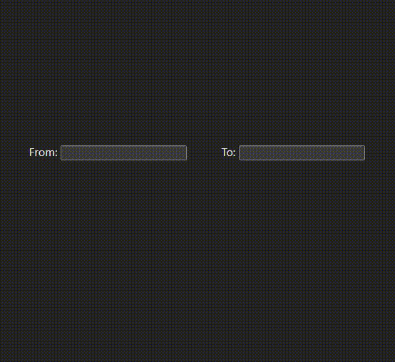

# React Date Picker Component

The React Date Picker component is a customizable and user-friendly way to select dates and times in your React applications. It allows users to pick a single date or a date range with ease, providing validation and customization options for seamless integration into your projects.

## Features

### Date Selection

**-Users can select a single date by clicking on a specific day in the calendar.**
**-Users can choose a range of dates by selecting a start date and an end date.**
**-Users can manually input date values.**

### Validation

**-Ensures that the selected start date is valid based on specified constraints, such as not being later than the end date.**
**-Ensures that the selected end date is valid based on specified constraints, such as not being earlier than the start date.**

### Range Highlighting

**-Highlights the range of dates between the selected start date and end date for better visualization.**

### Time Selection

**-Allows users to choose a specific time along with the date, providing options for hours, minutes, and seconds.**

### Today Highlighting

**-Highlights the current date in the calendar for quick reference.**

### Date range presets
**-Allows user to choose from a list of preset ranges such as this week, previous week, next month etc.**

### Customization

**-Easily customize the appearance of the Date Picker component to match your application's design and branding.**

## Project Overview

    

